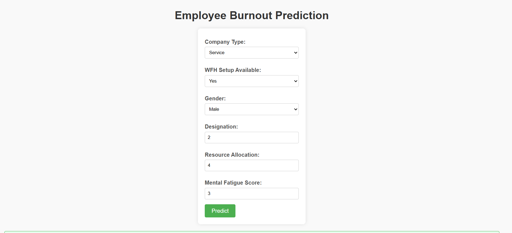

# Employee Burnout Prediction

## Project Overview
This project aims to predict employee burnout using machine learning models. Burnout is a state of emotional, physical, and mental exhaustion caused by prolonged stress in the workplace. Early detection of burnout can help organizations take proactive measures to improve employee well-being and productivity.

## Demo Images

Here are some screenshots from the project interface:




## Dataset
The dataset used for this project includes features such as:
- **Resource Allocation**: Percentage of resources assigned to an employee.
- **Mental Fatigue Score**: A score reflecting an employee's mental exhaustion.
- **Burn Rate**: The target variable, indicating the likelihood of employee burnout.

**Dataset Source**: [Kaggle Dataset - Are Your Employees Burning Out?](https://www.kaggle.com/datasets/blurredmachine/are-your-employees-burning-out)

### Data Preprocessing
The dataset contained missing values in the following columns:
- Resource Allocation
- Mental Fatigue Score
- Burn Rate

Missing values were handled using appropriate imputation techniques to ensure the dataset's integrity.

## Methodology
1. **Data Preprocessing**
   - Handling missing values.
   - Normalizing and scaling features.
   - Splitting the dataset into training and testing sets.

2. **Model Selection**
   - A Linear Regression model was chosen for predicting the Burn Rate.

3. **Model Evaluation**
   - The model's performance was evaluated using the following metrics:
     - Mean Squared Error (MSE): 0.0032
     - Root Mean Squared Error (RMSE): 0.0562
     - Mean Absolute Error (MAE): 0.0460
     - R-squared Score: 0.9188

## Results
The Linear Regression model achieved a high R-squared score, indicating that the model effectively explains the variance in the Burn Rate. This suggests that the model is well-suited for predicting employee burnout based on the available features.


## Tools and Technologies
- **Programming Language**: Python
- **Libraries Used**:
  - Pandas (for data manipulation)
  - NumPy (for numerical computations)
  - Scikit-learn (for machine learning)
  - Matplotlib & Seaborn (for data visualization)
  - Flask (for web interface)

## Web Interface
A web-based interface has been developed using Flask to allow users to interact with the model and predict burnout rates in real-time. Users can input employee data through the web application, and the model will return the predicted burnout score.

### Steps to Run the Web Interface:
1. Install Flask:
   ```bash
   pip install flask
   ```
2. Run the Flask application:
   ```bash
   python app.py
   ```
3. Open the web interface in a browser:
   ```
   http://127.0.0.1:5000/
   ```
4. Input employee data and view the predicted burnout rate.

## Usage Instructions
1. Clone the repository:
   ```bash
   git clone <repository-url>
   ```

2. Install the required dependencies:
   ```bash
   pip install -r requirements.txt
   ```

3. Run the notebook or script to:
   - Preprocess the dataset.
   - Train the Linear Regression model.
   - Evaluate the model's performance.

4. Run the Flask application for real-time predictions.

5. Input new employee data to predict burnout rates using the trained model.

## Key Files
- **`employee_burnout_data.csv`**: The dataset used for training and testing the model.
- **`model_training.py`**: Script for training the Linear Regression model.
- **`data_preprocessing.py`**: Script for handling missing values and preparing the dataset.
- **`burnout_prediction.ipynb`**: Jupyter notebook containing the complete workflow.
- **`app.py`**: Flask application for the web interface.

## Future Improvements
- Implementing advanced machine learning models such as Random Forest, XGBoost, or Neural Networks for better performance.
- Adding more features to the dataset for improved prediction accuracy.
- Enhancing the web-based application with better UI/UX and additional functionalities.

## Contribution Guidelines
Contributions to the project are welcome. Please follow these steps:
1. Fork the repository.
2. Create a new branch for your feature or bug fix.
3. Commit your changes and create a pull request.

## License
This project is licensed under the MIT License. Feel free to use and modify it as per your requirements.

## Acknowledgments
- The dataset provider and the open-source community for tools and libraries.
- Everyone who contributed to the project.
